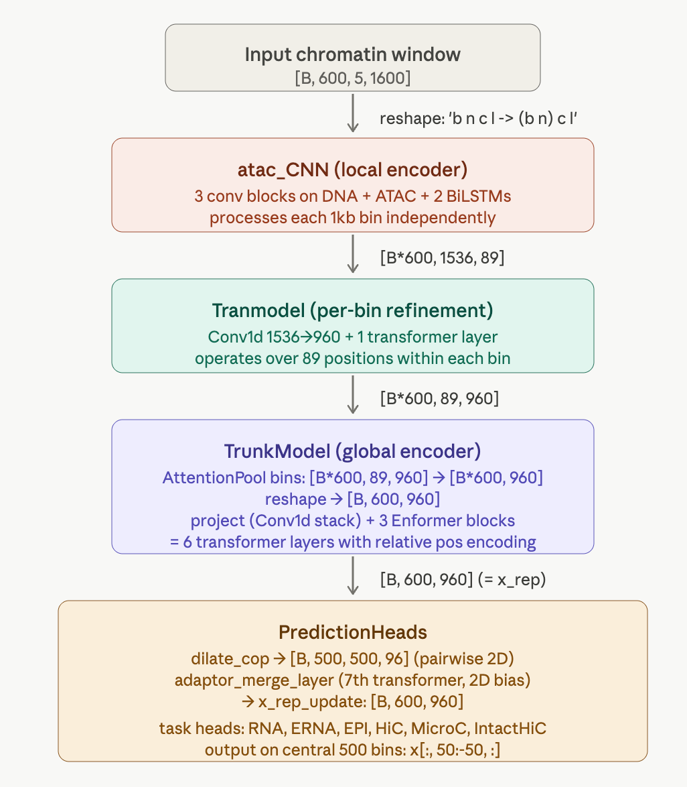
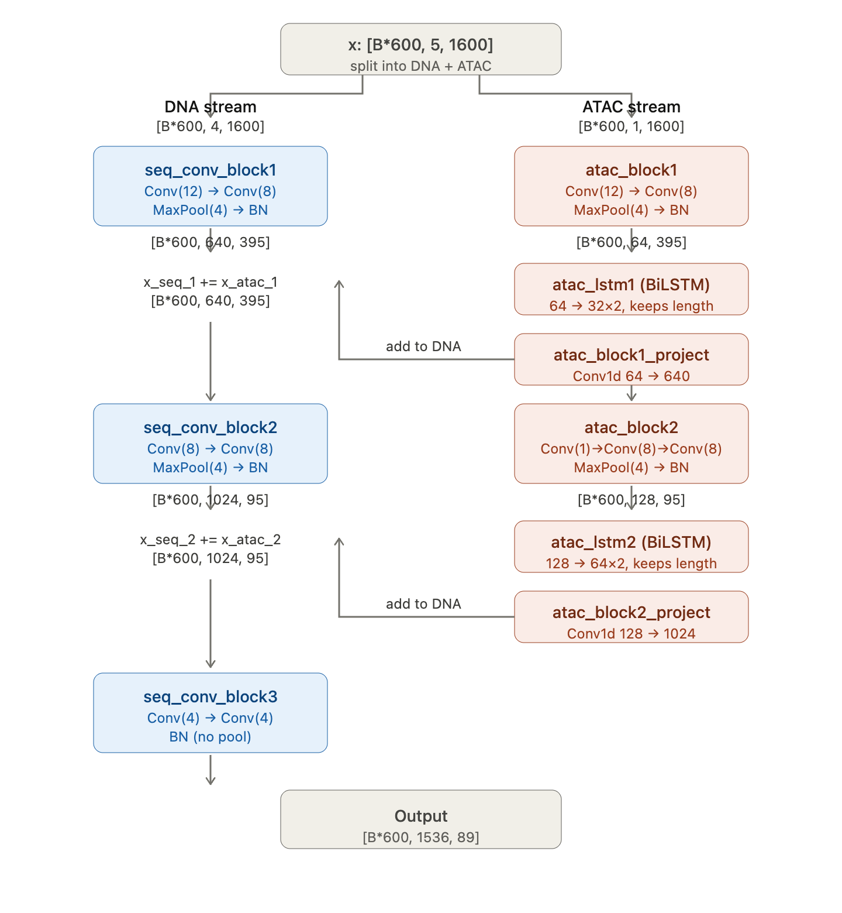

[Monthly Data track](https://docs.google.com/spreadsheets/d/1h-XOwoo0j8yyUnCtUFVTH2C4Ep8eSjISmqHu2hRg6hw/edit?gid=0#gid=0), every 10th of each month.

# Model Card for Genomic Foundation Model

This genomic foundation model is a transformer-based predictive framework designed for efficient large-scale genomic modeling. It integrates whole genome sequence (WGS) and chromatin accessibility profiles (ATAC-seq) to predict the expression levels of 19,264 protein-coding genes measured by RNA-seq. 

The architecture incorporates FlashAttention and linear attention mechanisms to enable scalable long-context modeling across genomic regions. Post-hoc interpretability analyses are applied to infer relationships among genetic variants, regulatory elements, and downstream transcriptomic outputs.

## Model Details

### Model Description

This model is a multi-modal genomic foundation model that jointly models DNA sequence and chromatin accessibility to predict transcriptomic outputs at the gene level. The architecture is based on a transformer backbone optimized for long genomic contexts using FlashAttention and linear attention mechanisms to reduce memory and computational overhead.

The model takes as input:
- Whole genome sequence (WGS)
- ATAC-seq chromatin accessibility signals

The model is trained using supervised regression objectives to learn sequence-to-expression mappings while integrating epigenomic regulatory information. Following prediction, post-hoc interpretation methods such as attention analysis, gradient-based attribution, and perturbation analysis are used to characterize relationships between genetic variants, regulatory regions, and gene expression.

This framework is intended for large-scale regulatory modeling, variant effect inference, and mechanistic exploration of genome-to-transcriptome relationships.

- **Developed by:** Liu Lab from University of Michigan
- **Funded by [optional]:** {{ funded_by | default("[More Information Needed]", true)}}
- **Shared by [optional]:** Xin Luo
- **Model type:** Transformer-based multi-modal genomic predictive model
- **Language(s):** Genomic sequence
- **License:** Apache 2.0
- **Finetuned from model [optional]:** Not determined yet.
### Model Sources [optional]

<!-- Provide the basic links for the model. -->

- **Repository:** {{ repo | default("[More Information Needed]", true)}}
- **Paper [optional]:** {{ paper | default("[More Information Needed]", true)}}
- **Demo [optional]:** {{ demo | default("[More Information Needed]", true)}}

## Uses

This model is intended for research use in computational genomics and regulatory biology. It enables large-scale modeling of genome-to-transcriptome relationships by integrating DNA sequence and chromatin accessibility signals.

### Direct Use

- Predicting RNA-seq gene expression levels from WGS and ATAC-seq inputs
- Modeling regulatory effects of genetic variants on transcript values
- Studying interactions between regulatory elements and target genes
- Variant effect prediction in non-coding regions

### Downstream Use [optional]

The model can be fine-tuned or adapted for:

- Disease-associated variant prioritization
- Regulatory element annotation
- Expression quantitative trait locus (eQTL) modeling

### Out-of-Scope Use

<!-- This section addresses misuse, malicious use, and uses that the model will not work well for. -->

{{ out_of_scope_use | default("[More Information Needed]", true)}}

## Bias, Risks, and Limitations

<!-- This section is meant to convey both technical and sociotechnical limitations. -->

{{ bias_risks_limitations | default("[More Information Needed]", true)}}

### Recommendations

<!-- This section is meant to convey recommendations with respect to the bias, risk, and technical limitations. -->

{{ bias_recommendations | default("Users (both direct and downstream) should be made aware of the risks, biases and limitations of the model. More information needed for further recommendations.", true)}}

## How to Get Started with the Model

Use the code below to get started with the model.

{{ get_started_code | default("[More Information Needed]", true)}}

## Training Details

### Training Data

The model was trained on matched chromatin accessibility, reference genome and RNA expression data from HPAP donor-derived cell/tissue samples. Training samples include alpha, beta, and exocrine cell/tissue profiles.

Training samples:

- `HPAP_004_beta`
- `HPAP_006_alpha`
- `HPAP_008_alpha`
- `HPAP_009_alpha`
- `HPAP_012_alpha`
- `HPAP_017_alpha`
- `HPAP_019_alpha`
- `HPAP_019_beta`
- `HPAP_022_alpha`
- `HPAP_022_beta`
- `HPAP_040_alpha`
- `HPAP_047_beta`
- `HPAP_072_alpha`
- `HPAP_077_beta`
- `HPAP_063_exocrine`

### Training Procedure

The model was trained using distributed data-parallel training with three processes. The training procedure takes preprocessed RNA expression data and preprocessed chromatin accessibility data as input. ATAC-seq-derived chromatin features are encoded by the local encoder, and the downstream prediction module learns to predict gene-level RNA expression values.

The model was initialized from a previous checkpoint:

```bash
/nfs/turbo/umms-drjieliu/usr/xinyubao/clipEPCOT/models/tss_ddp_6000_ddp/best_ddp.ckpt
```

#### Preprocessing [optional]

{{ preprocessing | default("[More Information Needed]", true)}}


#### Training Hyperparameters

- **Training regime:** Distributed data-parallel training with `torchrun`; numerical precision was not explicitly specified in the provided command.
- **Number of processes:** 3
- **Batch size:** 1
- **Epochs:** 10
- **Learning rate:** 1e-5
- **Weight decay:** 1e-3
- **Number of workers:** 4
- **Held-out chromosomes:** 10, 21
- **Chromatin loading chunk size:** 2000
- **Gradient accumulation genes:** 2000
- **Maximum genes per batch:** 16000
- **Gene chunk size:** 6
- **Number of TSS bins:** 2
- **Resume checkpoint:** `/nfs/turbo/umms-drjieliu/usr/xinyubao/clipEPCOT/models/tss_ddp_6000_ddp/best_ddp.ckpt`
- **Training tag:** `tss_ddp_alpha_beta_exo`

#### Speeds, Sizes, Times [optional]

<!-- This section provides information about throughput, start/end time, checkpoint size if relevant, etc. -->

{{ speeds_sizes_times | default("[More Information Needed]", true)}}

## Evaluation

Validation samples:

- `HPAP_051_alpha`
- `HPAP_051_beta`
- `HPAP_052_alpha`
- `HPAP_052_beta`
- `HPAP_054_alpha`
- `HPAP_066_exocrine`
- `HPAP_069_alpha`
- `HPAP_077_alpha`

Pearson Correlation Coefficient is used to evaluate the predicted gene expressions.

### Testing Data, Factors & Metrics

#### Testing Data

<!-- This should link to a Dataset Card if possible. -->

{{ testing_data | default("[More Information Needed]", true)}}

#### Factors

<!-- These are the things the evaluation is disaggregating by, e.g., subpopulations or domains. -->

{{ testing_factors | default("[More Information Needed]", true)}}

#### Metrics

<!-- These are the evaluation metrics being used, ideally with a description of why. -->

{{ testing_metrics | default("[More Information Needed]", true)}}

### Results

{{ results | default("[More Information Needed]", true)}}

#### Summary

{{ results_summary | default("", true) }}

## Model Examination [optional]

<!-- Relevant interpretability work for the model goes here -->

{{ model_examination | default("[More Information Needed]", true)}}

## Environmental Impact

<!-- Total emissions (in grams of CO2eq) and additional considerations, such as electricity usage, go here. Edit the suggested text below accordingly -->

Carbon emissions can be estimated using the [Machine Learning Impact calculator](https://mlco2.github.io/impact#compute) presented in [Lacoste et al. (2019)](https://arxiv.org/abs/1910.09700).

- **Hardware Type:** {{ hardware_type | default("[More Information Needed]", true)}}
- **Hours used:** {{ hours_used | default("[More Information Needed]", true)}}
- **Cloud Provider:** {{ cloud_provider | default("[More Information Needed]", true)}}
- **Compute Region:** {{ cloud_region | default("[More Information Needed]", true)}}
- **Carbon Emitted:** {{ co2_emitted | default("[More Information Needed]", true)}}

## Technical Specifications [optional]

### Model Architecture and Objective

The model is designed to predict gene expression from chromatin accessibility signals plus DNA sequence. It takes ATAC-seq–derived genomic features as input and uses a local encoder to extract regulatory representations around transcription start sites. The encoded features are then passed to the downstream prediction module to estimate gene-level RNA expression.

<p align="center">
  
</p>

The local encoder is based on an ATAC-CNN module, which learns local chromatin accessibility patterns from genomic bins and produces feature embeddings for downstream prediction.

<p align="center">
  
</p>

The training objective is to minimize the prediction error between the model-predicted gene expression values and the observed RNA expression values. During evaluation, model performance can be assessed using correlation-based metrics such as Pearson or Spearman correlation between predicted and observed gene expression profiles.

### Compute Infrastructure

{{ compute_infrastructure | default("[More Information Needed]", true)}}

#### Hardware

{{ hardware_requirements | default("[More Information Needed]", true)}}

#### Software

{{ software | default("[More Information Needed]", true)}}

## Citation [optional]

<!-- If there is a paper or blog post introducing the model, the APA and Bibtex information for that should go in this section. -->

**BibTeX:**

{{ citation_bibtex | default("[More Information Needed]", true)}}

**APA:**

{{ citation_apa | default("[More Information Needed]", true)}}

## Glossary [optional]

<!-- If relevant, include terms and calculations in this section that can help readers understand the model or model card. -->

{{ glossary | default("[More Information Needed]", true)}}

## More Information [optional]

{{ more_information | default("[More Information Needed]", true)}}

## Model Card Authors [optional]

Xin Luo

## Model Card Contact

luosanj@umich.edu
